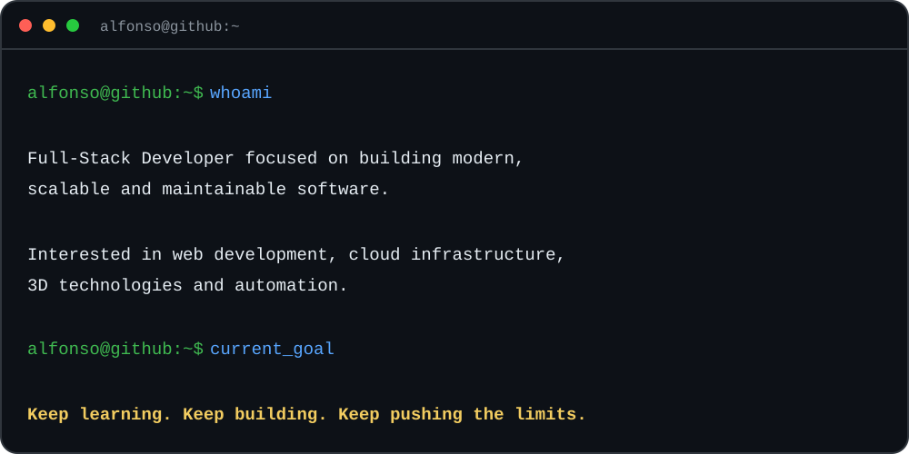
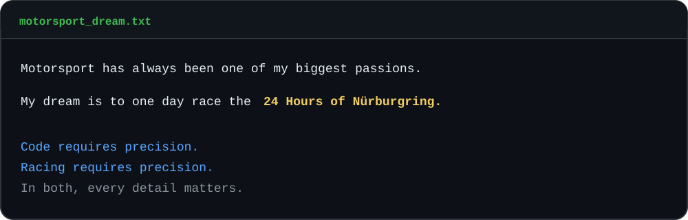
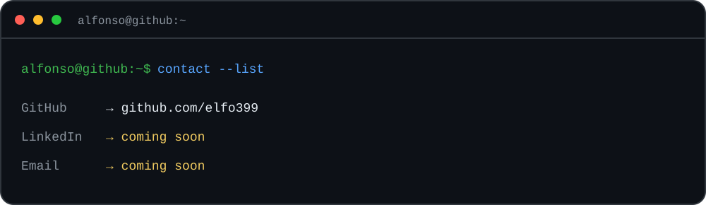

<div align="center">

# Alfonso Piteo

### Full-Stack Developer

**@elfo399**

</div>



---

## > tech_stack

```text
alfonso@github:~$ stack --show
```

<table>
<tr>
<td width="50%" valign="top">

#### backend & languages


`Java`

</td>
<td width="50%" valign="top">

#### frontend


`Angular`

</td>
</tr>
<tr>
<td width="50%" valign="top">

#### cloud & devops


`Docker` `AWS` `Azure`

</td>
<td width="50%" valign="top">

#### game development & 3D


`Unity` `Blender`

</td>
</tr>
</table>

```text
alfonso@github:~$ echo "build · deploy · create"
```

---

## > beyond_code



---

## > connect



<div align="center">

[](https://github.com/elfo399)

</div>

---

<div align="center">

### Code with precision. Build for scale. Chase the impossible.

</div>
